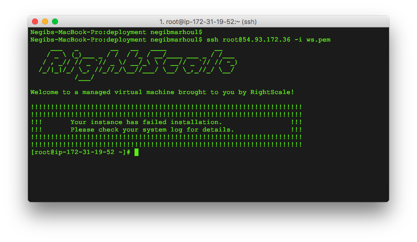

  **[Back to Agenda](./../README.md)**

# Lab 1 - Accessing the Cluster

DSE Clusters with 3 nodes has been spawns for your hands on today. Most of the time there is one cluster for 2 people. Please aks trainers to provide
you proper IP adresses for your cluster. For now will use the variable `${YOUR_CLUSTER_IP}` to IP adress of the seed node hosting all tools.

#### Discover your cluster

Open a web browser to your OpsCenter node. For this cluster, it's running at **http://YOUR_CLUSTER_IP:8888**.   


Mouse over the nodes in your ring. There should be three, with the names node0, node1 and node2. Click on node0 to display details. You can browse the
differents tabs and screens to see what metrics and KPI are available within this tools. For now we will connect to `node0`

#### Connect with SSH


We're now going to SSH into node and modify a configuration file. 

If you are on a Mac, you already have SSH installed in your terminal. If you are on Windows, you may need to install an SSH client. A popular SSH client is Putty. Putty can be downloaded from [http://www.putty.org](http://www.putty.org).

For this cluster, the username is ds_user. In the terminal I can ssh to the node.

You need to download key files to your local computer.   
- For Linux/Mac user it is a `PEM file`   
- For Windows user it is `PPK file` 

They can be downloaded [here](https://1fichier.com/?7jtu78cezullbzu9r31r). *(The file is protected for obvious reasons, ask the trainer to get the password).*

For this cluster, the username is **ds_user**. So, in the terminal I can ssh to the node by running the command:

```
On Linux/Mac
ssh ds_user@<my_node_ip> -i /path/to/keyfile/rs.pem

On Windows
ssh ds_user@<my_node_ip> -i /path/to/keyfile/rs.ppk

```

You may be prompted to accept the node's key. If so, type "yes" and hit enter.



Great!

#### First Commands


```bash
dsetool ring
```


Each node should say the words "Search" and "Analytics" and the Graph's column has the value "yes". If any of them don't, you may have to SSH back into that node and ensure the new configuration is set.

Note that one of the nodes says "(JT)" This is your **Spark** job track. You can view a webpage with information about Spark jobs by opening a web browser to port 7080 on that node. For this cluster that is at http://your_sparkMaster_node_ip:7080. Note your URL will be different.


We also enabled **Solr** on our nodes. You can actually view the Solr UI on any node. However, for our exercises we're going to use node0.  Open a web browser to port 8983 /solr/ on node0. For this cluster that is at http://YOUR_CLUSTER_IP:8983/solr. The URL will be different for your cluster.


Great! You've now logged into the administrative tool, OpsCenter, on your cluster. You've also used SSH to connect to each database node in your cluster. Finally you've logged into the administrative interfaces for both Spark and Solr. Next up we're going to start putting data in the database!

How is your node behave ? You can display information with the `status` command.

```bash
nodetool status
```

  **[Back to Agenda](./../README.md)**
