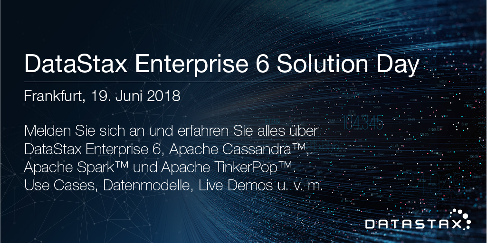

Welcome to DataStax Solution Day
========================================

In this repository, you'll learn all about DataStax Enterprise. You will find materials used during presentation, labs and reference applications. Feel free to bookmark this page for future reference!

### Agenda

| Time  | Work  | Title
|---|---|---|
| 09:05-10:00  | Lecture | [DataStax Enterprise Overview and Use cases](./01_Lectures/01_Product_Overview.pdf)  |
| 10:00-10:30  | Lab1 | [Accessing the environment](./02_Labs/01_Accessing_the_Cluster.md)  |
| 10:30-10:45  | --- | **Break**  |
| 10:45-12:00  | Lecture | [Core Cassandra](./01_Lectures/02_Core_Cassandra.pdf)  |

LUNCH

| Time  | Work  |
|---|---|
| 13:00-13:30  | [Lab2: HandsOn Cassandra](./02_Labs/02_Dse_Cassandra.md)  |
| 13:30-14:00  | [Introducing DSE Search](https://1fichier.com/?rcy5s1yrmi) |
| 14:00-14:30  | [Lab3: HandsOn Dse Search](./02_Labs/03_Dse_Search.md) |
| 14:00-14:30  | [Introducing DSE Analytics](./01_Lectures/04_Dse_Analytics.pdf) |
| 14:30-15:30  | [Lab4: HandsOn Dse Analytics](./02_Labs/04_Dse_Analytics.md) |
| 15:30-15:45  | **Break**  |
| 15:45-16:15  | [Introducing DSE](http://killrvideo.github.io) |
| 16:15-16:45  | [Lab5 : DSE Graph Graph](./02_Labs/05_Dse_Graph.md)  |
| 16:45-17:15  | [Building your applications with DSE](http://killrvideo.github.io) |

EOD

### Extra Materials

* Get involved more tutorials here [DataStax Academy](https://academy.datastax.com/)
* Learn more about [KillrVideo](https://github.com/killrvideo)
* Dse in Saas Mode [DataStax Managed Cloud](./03_Materials/DataStax_Managed_Cloud.pdf)

