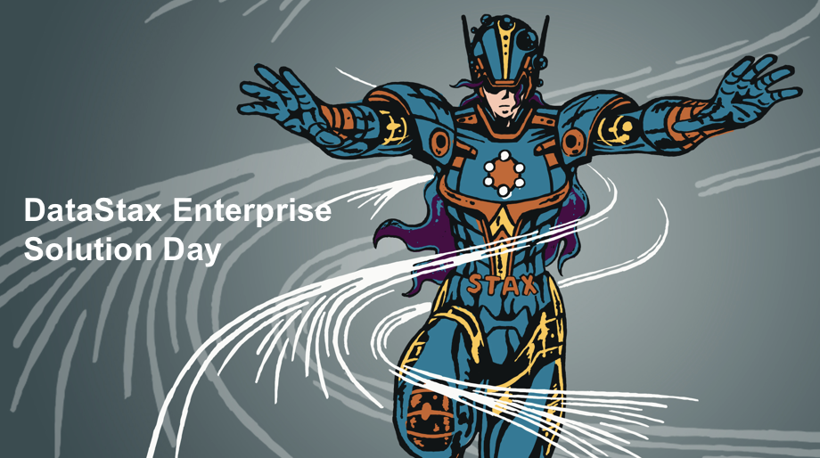

Welcome to DataStax Solution Day
========================================

In this repository, you'll learn all about DataStax Enterprise. You will find materials used during presentation, labs and reference applications. Feel free to bookmark this page for future reference!

### Agenda

| Time  | Type  | Title
|---|---|---|
| 09:05-10:00  | Lecture | [DataStax Enterprise Overview and Use cases](https://github.com/DataStax-Academy/solution-day-2018/blob/master/lectures/SD2018_01_Product_Overview.pptx)  |
| 10:00-10:30  | **Lab #1** | [Accessing the environment](./labs/lab1)  |
| 10:30-10:45  | **Break** | **Break**  |
| 10:45-12:00  | **Lecture** | [Core Cassandra](https://github.com/DataStax-Academy/solution-day-2018/blob/master/lectures/SD2018_02_Core_Cassandra.pptx)  |

LUNCH

| Time  | Type  | Title
|---|---|---|
| 13:00-13:30  | **Lab #2**  | [HandsOn Cassandra](./labs/lab2)  |
| 13:30-14:00  | **Lecture** | [Introducing DSE Search](https://github.com/DataStax-Academy/solution-day-2018/blob/master/lectures/SD2018_03_Dse_Search.pptx) |
| 14:00-14:30  | **Lab #3**  | [HandsOn Dse Search](./labs/lab3) |
| 14:00-14:30  | **Lecture** | [Introducing DSE Analytics](https://github.com/DataStax-Academy/solution-day-2018/blob/master/lectures/SD2018_04_Dse_Analytics.pptx) |
| 14:30-15:30  | **Lab #4**  | [HandsOn Dse Analytics](./labs/lab4) |
| 15:30-15:45  | **Break**   | **Break** 
| 15:45-16:15  | **Lecture** | [Introducing DSE Graph](https://github.com/DataStax-Academy/solution-day-2018/blob/master/lectures/SD2018_05_Dse%20Graph.pptx) |
| 16:15-16:45  | **Lab #5**  | [Lab5 : DSE Graph Graph](./labs/lab5)  |
| 16:45-17:15  | **Lecture** | [Building your applications with DSE](http://killrvideo.github.io) |

EOD

### Extra Materials

* Get involved more tutorials here [DataStax Academy](https://academy.datastax.com/)
* Learn more about [KillrVideo](https://github.com/killrvideo)
* Dse in Saas Mode [DataStax Managed Cloud](./03_Materials/DataStax_Managed_Cloud.pdf)
* More sample codes [HERE](https://github.com/DataStaxCodeSamples)

